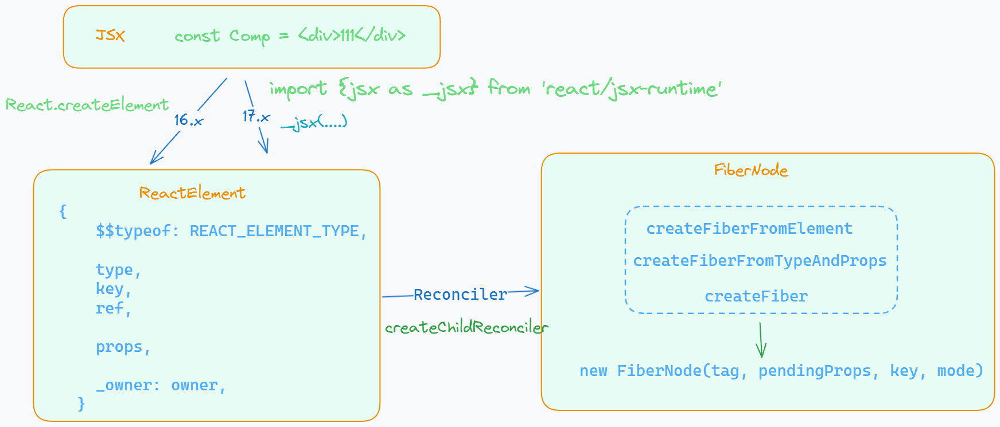
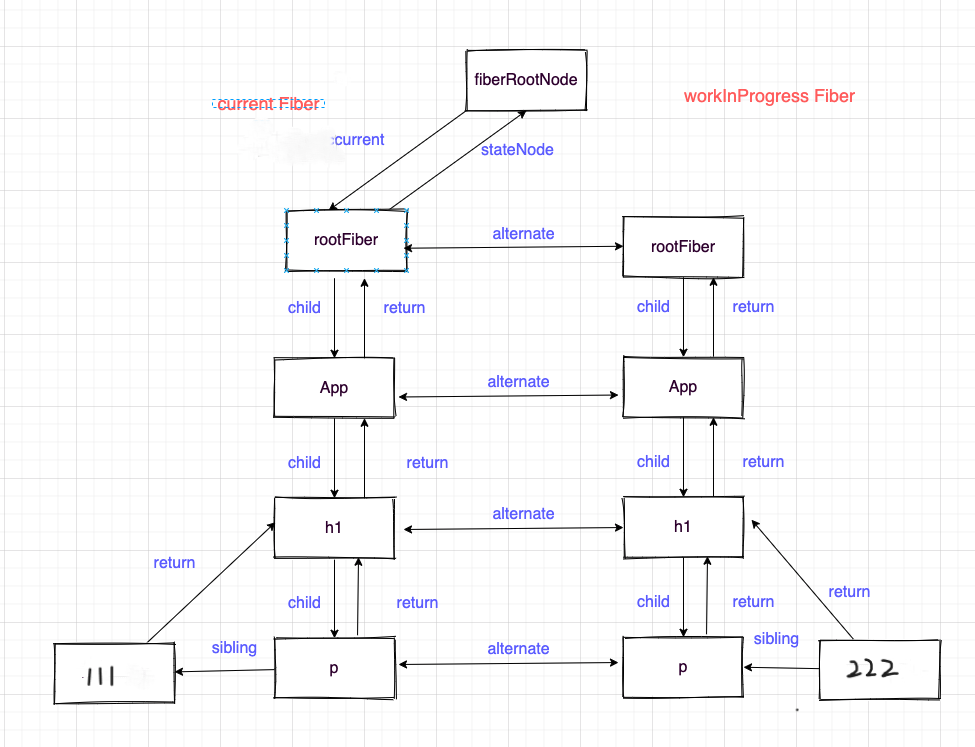
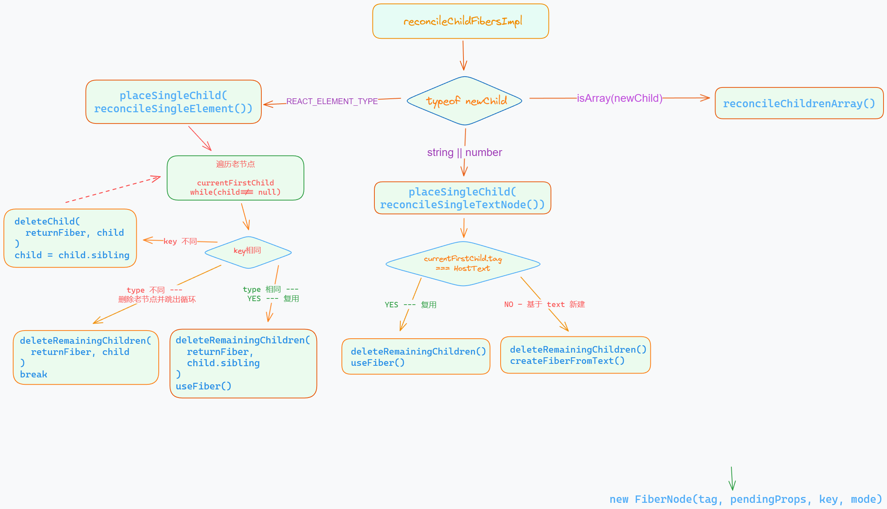

# React-Diff

## jsx - ReactElement - FiberNode 及转换

> https://zh-hans.legacy.reactjs.org/blog/2020/09/22/introducing-the-new-jsx-transform.html




```jsx
const Comp = <div>this is a div comp</div>;

<Comp /> ----------------- jsx (babel 处理)

import React from 'react';

const Comp = React.createElement('div', null, 'this is a div comp');

// 17.x
// 由编译器引入（禁止自己引入！）
import {jsx as _jsx} from 'react/jsx-runtime';

function App() {
  return _jsx('div', { children: 'this is a div comp' });
}

// packages\react\src\jsx\ReactJSXElement.js
export function jsxProd(type, config, maybeKey) {
  let propName;

  // Reserved names are extracted
  const props = {};

  let key = null;
  let ref = null;

  if (hasValidKey(config)) {
    key = '' + config.key;
  }

  if (hasValidRef(config)) {
    if (!enableRefAsProp) {
      ref = config.ref;
    }
  }

  // Remaining properties are added to a new props object
  for (propName in config) {
    if (
      hasOwnProperty.call(config, propName) &&
      // Skip over reserved prop names
      propName !== 'key' &&
      (enableRefAsProp || propName !== 'ref')
    ) {
      props[propName] = config[propName];
    }
  }

  // Resolve default props
  if (type && type.defaultProps) {
    const defaultProps = type.defaultProps;
    for (propName in defaultProps) {
      if (props[propName] === undefined) {
        props[propName] = defaultProps[propName];
      }
    }
  }

  return ReactElement(
    type,
    key,
    ref,
    undefined,
    undefined,
    ReactCurrentOwner.current,
    props,
  );
}

// ------------------------- ReactElement ------------------------------------
// packages\react\src\jsx\ReactJSXElement.js

function ReactElement(type, key, _ref, self, source, owner, props) {
  let ref;
  ref = _ref;

  let element;
  // In prod, `ref` is a regular property. It will be removed in a
  // future release.
  element = {
    // This tag allows us to uniquely identify this as a React Element
    $$typeof: REACT_ELEMENT_TYPE,

    // Built-in properties that belong on the element
    type,
    key,
    ref,

    props,

    // Record the component responsible for creating this element.
    _owner: owner,
  };

  return element;
}

// -------------------------------------------------------
// packages\react-reconciler\src\ReactFiber.js
export function createFiberFromElement(
  element: ReactElement,
  mode: TypeOfMode,
  lanes: Lanes,
): Fiber {
  let owner = null;
  const type = element.type;
  const key = element.key;
  const pendingProps = element.props;
  const fiber = createFiberFromTypeAndProps(
    type,
    key,
    pendingProps,
    owner,
    mode,
    lanes,
  );

  return fiber;
}

export function createFiberFromTypeAndProps(
  type: any, // React$ElementType
  key: null | string,
  pendingProps: any,
  owner: null | Fiber,
  mode: TypeOfMode,
  lanes: Lanes,
): Fiber {
  let fiberTag = IndeterminateComponent;
  // The resolved type is set if we know what the final type will be. I.e. it's not lazy.
  let resolvedType = type;
  const fiber = createFiber(fiberTag, pendingProps, key, mode);
  fiber.elementType = type;
  fiber.type = resolvedType;
  fiber.lanes = lanes;

  return fiber;
}

function createFiber(
  tag: WorkTag,
  pendingProps: mixed,
  key: null | string,
  mode: TypeOfMode,
): Fiber {
  // $FlowFixMe[invalid-constructor]: the shapes are exact here but Flow doesn't like constructors
  return new FiberNode(tag, pendingProps, key, mode);
}

// ------------------------- FiberNode ------------------------------------
// packages\react-reconciler\src\ReactFiber.js
function FiberNode(
  this: $FlowFixMe,
  tag: WorkTag,
  pendingProps: mixed,
  key: null | string,
  mode: TypeOfMode,
) {
  // Instance
  this.tag = tag;
  this.key = key;
  this.elementType = null;
  this.type = null;
  this.stateNode = null;

  // Fiber
  this.return = null;
  this.child = null;
  this.sibling = null;
  this.index = 0;

  this.ref = null;
  this.refCleanup = null;

  this.pendingProps = pendingProps;
  this.memoizedProps = null;
  this.updateQueue = null;
  this.memoizedState = null;
  this.dependencies = null;

  this.mode = mode;

  // Effects
  this.flags = NoFlags;
  this.subtreeFlags = NoFlags;
  this.deletions = null;

  this.lanes = NoLanes;
  this.childLanes = NoLanes;

  this.alternate = null;
}

const compFiber = {
    "type": "div",
    "key": "aaaa",
    "index": 0,
    "flags": 0,
    "tag": 5,
    "ref": null,
    "props": {
        "children": "this is a div comp"
    },
    "lanes": 0,
    "return": FiberNode {tag: 0, key: null, stateNode: null, elementType: ƒ, type: ƒ, …},
    "sibling": null,
    "_owner": null,
    "_store": {}
}
```

实际截图案例：


## Fiber

### 基础信息

一个 js Object（链表），dom 节点对应的 virtual dom（更方便、高效操作，并非一定比操作真实 dom 快）

> 是 React 16 中（之前是直接从根部递归遍历渲染，不能被打断，有较长任务时阻塞页面）引入的重要概念，旨在优化渲染过程、实现任务调度、异步渲染，并提高应用的性能和用户体验

> 将渲染过程分割成多个小任务，通过任务优先级和时间片的概念，使得可以灵活地控制任务的调度和执行。这样当浏览器主线程还有空闲时间时，React 可以中断当前任务，然后处理其他紧急任务或 I/O 操作，提高了页面的响应性能。同时，React Fiber 也支持增量渲染，即将渲染工作分解成多个步骤，每次只渲染一小部分，不会阻塞主线程太久


### 双缓存

在 React 的 fiber 中最多会存在两棵 Fiber 树，显示在屏幕上的叫做 Current Fiber Tree，正在内存构建的是 WorkInProgress Fiber Tree。



### 源码

> packages\react-reconciler\src\ReactInternalTypes.js

```js
// A Fiber is work on a Component that needs to be done or was done. There can
// be more than one per component.
export type Fiber = {
  // These first fields are conceptually members of an Instance. This used to
  // be split into a separate type and intersected with the other Fiber fields,
  // but until Flow fixes its intersection bugs, we've merged them into a
  // single type.

  // An Instance is shared between all versions of a component. We can easily
  // break this out into a separate object to avoid copying so much to the
  // alternate versions of the tree. We put this on a single object for now to
  // minimize the number of objects created during the initial render.

  // Tag identifying the type of fiber. 比如 function/class/fragment/ForwardRef/...
  tag: WorkTag,

  // Unique identifier of this child. comp key 唯一值
  key: null | string,

  // The value of element.type which is used to preserve the identity during
  // reconciliation of this child.
  // 节点类型：div/span/...
  elementType: any,

  // The resolved function/class/ associated with this fiber.
  type: any,

  // The local state associated with this fiber.
  stateNode: any,

  // Conceptual aliases
  // parent : Instance -> return The parent happens to be the same as the
  // return fiber since we've merged the fiber and instance.

  // Remaining fields belong to Fiber

  // The Fiber to return to after finishing processing this one.
  // This is effectively the parent, but there can be multiple parents (two)
  // so this is only the parent of the thing we're currently processing.
  // It is conceptually the same as the return address of a stack frame.
  // 其父节点
  return: Fiber | null,

  // Singly Linked List Tree Structure.
  // 其子节点
  child: Fiber | null,
  // 其兄弟节点
  sibling: Fiber | null,
  // 同层级的索引
  index: number,

  // The ref last used to attach this node.
  // I'll avoid adding an owner field for prod and model that as functions.
  ref:
    | null
    | (((handle: mixed) => void) & {_stringRef: ?string, ...})
    | RefObject,

  refCleanup: null | (() => void),

  // props && state
  // Input is the data coming into process this fiber. Arguments. Props.
  pendingProps: any, // This type will be more specific once we overload the tag.
  memoizedProps: any, // The props used to create the output.

  // A queue of state updates and callbacks.
  updateQueue: mixed,

  // The state used to create the output
  memoizedState: any,

  // Dependencies (contexts, events) for this fiber, if it has any
  dependencies: Dependencies | null,

  // Bitfield that describes properties about the fiber and its subtree. E.g.
  // the ConcurrentMode flag indicates whether the subtree should be async-by-
  // default. When a fiber is created, it inherits the mode of its
  // parent. Additional flags can be set at creation time, but after that the
  // value should remain unchanged throughout the fiber's lifetime, particularly
  // before its child fibers are created.
  // 描述 Fiber 工作模式的标志（例如 Concurrent 模式、StrictLegacyMode 模式等）
  mode: TypeOfMode,

  // Effect
  // 存储副作用的标记，例如DOM更新、生命周期方法调用等。React会积累这些副作用，然后在 commit 阶段一次性执行，从而提高效率
  //   假设有两种标识符：
  // Placement (表示新插入的子节点)：0b001
  // Update (表示子节点已更新)：0b010

  // A
  // ├─ B (Update)
  // │   └─ D (Placement)
  // └─ C
  //    └─ E

  // 这个例子里，计算逻辑是这样：
  // 1、检查到 A的 flags 没有副作用，直接复用，但 subtreeFlags 有副作用，那么递归检查 B 和 C
  // 2、检查到 B的 flags 有复用，更新 B，subtreeFlags 也有副作用，则继续检查 D
  // 3、检查到 C的 flags 没有副作用，subtreeFlags 也没有副作用，那么直接复用C和E
  // 如果节点更多，则以此类推。
  // 这样的计算方式可以减少递归那些没有副作用的子树或节点，所以比以前的版本全部递归的算法要高效
  flags: Flags,
  subtreeFlags: Flags,
  // 要删除的子节点
  deletions: Array<Fiber> | null,

  // lane 模型相关（主要是调度时）
  lanes: Lanes,
  childLanes: Lanes,

  // This is a pooled version of a Fiber. Every fiber that gets updated will
  // eventually have a pair. There are cases when we can clean up pairs to save
  // memory if we need to.
  // current tree <--> [work in progress] tree 互相指向
  // 更新时只需要将 fiberRoot 从 current tree 切换到 WIP tree，此时 WIP tree --> current tree
  alternate: Fiber | null,

  // ...
};
```

> https://juejin.cn/post/7258881840823844920

## Lane

> packages\react-reconciler\src\ReactFiberLane.js

> lane 模型的技术本质就是「二进制 + 按位运算」。
> 
> 它的巧妙之处，它除了表示值，它还能表示「某种类型任务的存在性」和「一批任务」的语义

```js
export const TotalLanes = 31;

export const NoLanes: Lanes = /*                        */ 0b0000000000000000000000000000000;
export const NoLane: Lane = /*                          */ 0b0000000000000000000000000000000;

export const SyncLane: Lane = /*                        */ 0b0000000000000000000000000000010;
export const SyncUpdateLanes: Lane = enableUnifiedSyncLane
  ? SyncLane | InputContinuousLane | DefaultLane
  : SyncLane;

const TransitionHydrationLane: Lane = /*                */ 0b0000000000000000000000001000000;
const TransitionLanes: Lanes = /*                       */ 0b0000000001111111111111110000000;
const TransitionLane1: Lane = /*                        */ 0b0000000000000000000000010000000;
const TransitionLane2: Lane = /*                        */ 0b0000000000000000000000100000000;
const TransitionLane3: Lane = /*                        */ 0b0000000000000000000001000000000;
const TransitionLane4: Lane = /*                        */ 0b0000000000000000000010000000000;
const TransitionLane5: Lane = /*                        */ 0b0000000000000000000100000000000;
const TransitionLane6: Lane = /*                        */ 0b0000000000000000001000000000000;
const TransitionLane7: Lane = /*                        */ 0b0000000000000000010000000000000;
const TransitionLane8: Lane = /*                        */ 0b0000000000000000100000000000000;
const TransitionLane9: Lane = /*                        */ 0b0000000000000001000000000000000;
const TransitionLane10: Lane = /*                       */ 0b0000000000000010000000000000000;
const TransitionLane11: Lane = /*                       */ 0b0000000000000100000000000000000;
const TransitionLane12: Lane = /*                       */ 0b0000000000001000000000000000000;
const TransitionLane13: Lane = /*                       */ 0b0000000000010000000000000000000;
const TransitionLane14: Lane = /*                       */ 0b0000000000100000000000000000000;
const TransitionLane15: Lane = /*                       */ 0b0000000001000000000000000000000;

// -----------------------------------------------------------------------------------------------

export function includesSomeLane(a: Lanes | Lane, b: Lanes | Lane): boolean {
  return (a & b) !== NoLanes;
}

export function isSubsetOfLanes(set: Lanes, subset: Lanes | Lane): boolean {
  return (set & subset) === subset;
}

export function mergeLanes(a: Lanes | Lane, b: Lanes | Lane): Lanes {
  return a | b;
}

export function removeLanes(set: Lanes, subset: Lanes | Lane): Lanes {
  return set & ~subset;
}

export function intersectLanes(a: Lanes | Lane, b: Lanes | Lane): Lanes {
  return a & b;
}
export function higherPriorityLane(a: Lane, b: Lane): Lane {
  // This works because the bit ranges decrease in priority as you go left.
  return a !== NoLane && a < b ? a : b;
}
```

为什么从 expirationTime 模型转到 lane 模型中来？

> https://juejin.cn/post/7282962960212639805

## react-diff

### 流程



### 文本

 - 如果当前 fiber 也为文本类型的节点时，`deleteRemainingChildren` 对第一个旧子 fiber 的所有兄弟 fiber 添加 `Deletion` 副作用标记，然后通过 `useFiber` 基于当前 fiber 和 `textContent` 创建新的 fiber 复用，同时将其 `return` 指向父 fiber
 - 否则 `deleteRemainingChildren` 对所有旧的子 fiber 添加 `Deletion` 副作用标记，然后 `createFiberFromText` 创建新的文本类型 fiber 节点，并将其 `return` 指向父 fiber

```js
function reconcileSingleTextNode(
    returnFiber: Fiber,
    currentFirstChild: Fiber | null,
    textContent: string,
    lanes: Lanes,
  ): Fiber {
    // There's no need to check for keys on text nodes since we don't have a
    // way to define them.
    if (currentFirstChild !== null && currentFirstChild.tag === HostText) {
      // We already have an existing node so let's just update it and delete
      // the rest.
      deleteRemainingChildren(returnFiber, currentFirstChild.sibling);
      const existing = useFiber(currentFirstChild, textContent);
      existing.return = returnFiber;
      return existing;
    }
    // The existing first child is not a text node so we need to create one
    // and delete the existing ones.
    deleteRemainingChildren(returnFiber, currentFirstChild);
    const created = createFiberFromText(textContent, returnFiber.mode, lanes);
    created.return = returnFiber;
    return created;
  }
```

### 单节点

`reconcileSingleElement` 函数中，会遍历父 fiber 下所有的旧的子 fiber，寻找与新生成的 ReactElement 内容的 key 和 type 都相同的子 fiber。每次遍历对比的过程中：

 - 若当前旧的子 fiber 与新内容 key 或 type 不一致，对当前旧的子 fiber 添加 `Deletion` 副作用标记（用于 dom 更新时删除），继续对比下一个旧子 fiber
 - 若当前旧的子 fiber 与新内容 key 或 type 一致，则判断为可复用，通过 `deleteRemainingChildren` 对该子 fiber 后面所有的兄弟 fiber 添加 `Deletion` 副作用标记，然后通过 useFiber 基于该子 fiber 和新内容的 props 生成新的 fiber 进行复用，结束遍历。

如果遍历完仍没找到复用节点，此时父 fiber 下的所有旧的子 fiber 都已经添加了 `Deletion` 副作用标记，通过 `createFiberFromElement` 基于新内容创建新的 fiber 并将其 `return` 指向父 fiber。

```js
/**
   * 
   * @param {*} returnFiber 父级 fiber
   * @param {*} currentFirstChild 当前 fiber 的第一个子节点，当前 fiber 即指 currentFiber，即旧的
   * @param {*} element 新的子节点
   * @param {*} lanes 
   * @returns 新的第一个子节点
   */
  function reconcileSingleElement(
    returnFiber: Fiber,
    currentFirstChild: Fiber | null,
    element: ReactElement,
    lanes: Lanes,
    debugInfo: ReactDebugInfo | null,
  ): Fiber {
    const key = element.key;
    let child = currentFirstChild;
    // 遍历处理：在旧节点中寻找可以复用的
    while (child !== null) {
      // TODO: If key === null and child.key === null, then this only applies to
      // the first item in the list.
      if (child.key === key) {
        const elementType = element.type;
        // 当 key、type 都相同时
        if (child.elementType === elementType) {// 比如都是 div div
          // 删掉 child 的相邻节点，不包括 child，因为此时满足复用条件
          deleteRemainingChildren(returnFiber, child.sibling);
          // 开始复用并返回
          const existing = useFiber(child, element.props);
          coerceRef(returnFiber, child, existing, element);
          // return 指向父节点
          existing.return = returnFiber;

          return existing;
        }
        // 当 key 相同、type 不相同时会直接删除剩余的子节点，包括当前的子节点
        // 如果 
        // Didn't match.
        deleteRemainingChildren(returnFiber, child);
        break;
      } else {
        // key 不相同时则直接不复用，删除节点
        deleteChild(returnFiber, child);
      }
      // 将 child 指向下一个相邻节点
      child = child.sibling;
    }

    // 遍历结束仍没有找到复用的节点，则删除所有的旧节点（while 循环已完成标记）并创建新节点、更新 return
    const created = createFiberFromElement(element, returnFiber.mode, lanes);
    coerceRef(returnFiber, currentFirstChild, created, element);
    created.return = returnFiber;
    return created;
  }
```

### 多节点

```js

```

## 所有核心源码

```js
// This wrapper function exists because I expect to clone the code in each path
// to be able to optimize each path individually by branching early. This needs
// a compiler or we can do it manually. Helpers that don't need this branching
// live outside of this function.
function createChildReconciler(
  shouldTrackSideEffects: boolean,
): ChildReconciler {
  // 把需要删除的子节点放入父节点的 deletions，便于后续处理
  function deleteChild(returnFiber: Fiber, childToDelete: Fiber): void {
    if (!shouldTrackSideEffects) {
      // Noop.
      return;
    }
    const deletions = returnFiber.deletions;
    if (deletions === null) {
      returnFiber.deletions = [childToDelete];
      returnFiber.flags |= ChildDeletion;
    } else {
      deletions.push(childToDelete);
    }
  }

  // 删掉剩余的子节点，deleteChild 方法的数组版
  function deleteRemainingChildren(
    returnFiber: Fiber,
    currentFirstChild: Fiber | null,
  ): null {
    if (!shouldTrackSideEffects) {
      // Noop.
      return null;
    }

    // TODO: For the shouldClone case, this could be micro-optimized a bit by
    // assuming that after the first child we've already added everything.
    let childToDelete = currentFirstChild;
    while (childToDelete !== null) {
      deleteChild(returnFiber, childToDelete);
      childToDelete = childToDelete.sibling;
    }
    return null;
  }

  function mapRemainingChildren(
    currentFirstChild: Fiber,
  ): Map<string | number, Fiber> {
    // Add the remaining children to a temporary map so that we can find them by
    // keys quickly. Implicit (null) keys get added to this set with their index
    // instead.
    const existingChildren: Map<string | number, Fiber> = new Map();

    let existingChild: null | Fiber = currentFirstChild;
    while (existingChild !== null) {
      if (existingChild.key !== null) {
        existingChildren.set(existingChild.key, existingChild);
      } else {
        existingChildren.set(existingChild.index, existingChild);
      }
      existingChild = existingChild.sibling;
    }
    return existingChildren;
  }

  function useFiber(fiber: Fiber, pendingProps: mixed): Fiber {
    // We currently set sibling to null and index to 0 here because it is easy
    // to forget to do before returning it. E.g. for the single child case.
    const clone = createWorkInProgress(fiber, pendingProps);
    clone.index = 0;
    clone.sibling = null;
    return clone;
  }

  function placeChild(
    newFiber: Fiber,
    lastPlacedIndex: number,
    newIndex: number,
  ): number {
    // 更新新的 fiber index 到 newIndex
    newFiber.index = newIndex;
    // 如果不需要跟踪副作用
    if (!shouldTrackSideEffects) {
      // 更新 flags
      // During hydration, the useId algorithm needs to know which fibers are
      // part of a list of children (arrays, iterators).
      newFiber.flags |= Forked;
      return lastPlacedIndex;
    }
    // 获取原来的 fiber
    const current = newFiber.alternate;
    if (current !== null) {
      const oldIndex = current.index;
      // 如果原来的 index 小于当前最新的不用移动的节点 index，说明在左侧，需要移动
      // A B C D
      // B A C D
      // B --> oldIndex = 1/lastPlacedIndex = 0 --> false --> not move --> 1
      // A --> oldIndex = 0/lastPlacedIndex = 1 --> true --> move --> 1
      // C --> oldIndex = 2/lastPlacedIndex = 1 --> false --> not move --> 2
      // D --> oldIndex = 3/lastPlacedIndex = 2 --> false --> not move
      if (oldIndex < lastPlacedIndex) {
        // This is a move.
        newFiber.flags |= Placement | PlacementDEV;
        return lastPlacedIndex;
      } else {
        // This item can stay in place.
        return oldIndex;
      }
    } else {
      // 原来的 fiber 为空表示这个节点不在旧的 Fiber tree 中，为一个新的，即插入
      // This is an insertion.
      newFiber.flags |= Placement | PlacementDEV;
      return lastPlacedIndex;
    }
  }

  function placeSingleChild(newFiber: Fiber): Fiber {
    // This is simpler for the single child case. We only need to do a
    // placement for inserting new children.
    if (shouldTrackSideEffects && newFiber.alternate === null) {
      newFiber.flags |= Placement | PlacementDEV;
    }
    return newFiber;
  }

  function updateTextNode(
    returnFiber: Fiber,
    current: Fiber | null,
    textContent: string,
    lanes: Lanes,
    debugInfo: ReactDebugInfo | null,
  ) {
    if (current === null || current.tag !== HostText) {
      // Insert
      const created = createFiberFromText(textContent, returnFiber.mode, lanes);
      created.return = returnFiber;

      return created;
    } else {
      // Update
      const existing = useFiber(current, textContent);
      existing.return = returnFiber;

      return existing;
    }
  }

  function createChild(
    returnFiber: Fiber,
    newChild: any,
    lanes: Lanes,
    debugInfo: ReactDebugInfo | null,
  ): Fiber | null {
    if (
      (typeof newChild === 'string' && newChild !== '') ||
      typeof newChild === 'number' ||
      (enableBigIntSupport && typeof newChild === 'bigint')
    ) {
      // Text nodes don't have keys. If the previous node is implicitly keyed
      // we can continue to replace it without aborting even if it is not a text
      // node.
      const created = createFiberFromText(
        // $FlowFixMe[unsafe-addition] Flow doesn't want us to use `+` operator with string and bigint
        '' + newChild,
        returnFiber.mode,
        lanes,
      );
      created.return = returnFiber;
      return created;
    }

    if (typeof newChild === 'object' && newChild !== null) {
      switch (newChild.$$typeof) {
        case REACT_ELEMENT_TYPE: {
          const created = createFiberFromElement(
            newChild,
            returnFiber.mode,
            lanes,
          );
          coerceRef(returnFiber, null, created, newChild);
          created.return = returnFiber;
          return created;
        }
      }

      if (isArray(newChild) || getIteratorFn(newChild)) {
        const created = createFiberFromFragment(
          newChild,
          returnFiber.mode,
          lanes,
          null,
        );
        created.return = returnFiber;
        return created;
      }
    }

    return null;
  }

  function updateFromMap(
    existingChildren: Map<string | number, Fiber>,
    returnFiber: Fiber,
    newIdx: number,
    newChild: any,
    lanes: Lanes,
    debugInfo: ReactDebugInfo | null,
  ): Fiber | null {
    if (
      (typeof newChild === 'string' && newChild !== '') ||
      typeof newChild === 'number' ||
      (enableBigIntSupport && typeof newChild === 'bigint')
    ) {
      // Text nodes don't have keys, so we neither have to check the old nor
      // new node for the key. If both are text nodes, they match.
      const matchedFiber = existingChildren.get(newIdx) || null;
      return updateTextNode(
        returnFiber,
        matchedFiber,
        // $FlowFixMe[unsafe-addition] Flow doesn't want us to use `+` operator with string and bigint
        '' + newChild,
        lanes,
        debugInfo,
      );
    }

    if (typeof newChild === 'object' && newChild !== null) {
      switch (newChild.$$typeof) {
        case REACT_ELEMENT_TYPE: {
          const matchedFiber =
            existingChildren.get(
              newChild.key === null ? newIdx : newChild.key,
            ) || null;
          return updateElement(
            returnFiber,
            matchedFiber,
            newChild,
            lanes,
            mergeDebugInfo(debugInfo, newChild._debugInfo),
          );
        }
      }

      if (isArray(newChild) || getIteratorFn(newChild)) {
        const matchedFiber = existingChildren.get(newIdx) || null;
        return updateFragment(
          returnFiber,
          matchedFiber,
          newChild,
          lanes,
          null,
          mergeDebugInfo(debugInfo, newChild._debugInfo),
        );
      }
    }

    return null;
  }

  // 处理多节点的 diff 
  function reconcileChildrenArray(
    returnFiber: Fiber,
    currentFirstChild: Fiber | null,
    newChildren: Array<any>,
    lanes: Lanes,
    debugInfo: ReactDebugInfo | null,
  ): Fiber | null {
    // This algorithm can't optimize by searching from both ends since we
    // don't have backpointers on fibers. I'm trying to see how far we can get
    // with that model. If it ends up not being worth the tradeoffs, we can
    // add it later.

    // Even with a two ended optimization, we'd want to optimize for the case
    // where there are few changes and brute force the comparison instead of
    // going for the Map. It'd like to explore hitting that path first in
    // forward-only mode and only go for the Map once we notice that we need
    // lots of look ahead. This doesn't handle reversal as well as two ended
    // search but that's unusual. Besides, for the two ended optimization to
    // work on Iterables, we'd need to copy the whole set.

    // In this first iteration, we'll just live with hitting the bad case
    // (adding everything to a Map) in for every insert/move.

    // If you change this code, also update reconcileChildrenIterator() which
    // uses the same algorithm.

    let resultingFirstChild: Fiber | null = null;
    let previousNewFiber: Fiber | null = null;

    let oldFiber = currentFirstChild;
    let lastPlacedIndex = 0;
    let newIdx = 0;
    let nextOldFiber = null;
    // 第一轮循环
    // 遍历新旧节点，尝试复用旧的节点，更新相关值
    for (; oldFiber !== null && newIdx < newChildren.length; newIdx++) {
      if (oldFiber.index > newIdx) {
        nextOldFiber = oldFiber;
        oldFiber = null;
      } else {
        // 暂存旧的下一个节点
        nextOldFiber = oldFiber.sibling;
      }
      // 尝试复用旧的节点
      const newFiber = updateSlot(
        returnFiber,
        oldFiber,
        newChildren[newIdx],
        lanes,
        debugInfo,
      );
      // 如果尝试复用的节点都为 null，直接 break
      if (newFiber === null) {
        // TODO: This breaks on empty slots like null children. That's
        // unfortunate because it triggers the slow path all the time. We need
        // a better way to communicate whether this was a miss or null,
        // boolean, undefined, etc.
        if (oldFiber === null) {
          oldFiber = nextOldFiber;
        }
        break;
      }
      if (shouldTrackSideEffects) {
        // 如果旧的 fiber 存在且尝试复用的新的 fiber 又没有对应的 
        // alternate(暂时理解为没有真实 DOM)，就直接删除掉旧的 fiber
        if (oldFiber && newFiber.alternate === null) {
          // We matched the slot, but we didn't reuse the existing fiber, so we
          // need to delete the existing child.
          deleteChild(returnFiber, oldFiber);
        }
      }
      // 更新新的节点的位置 index，即最新的不需要移动的节点原来的 index
      lastPlacedIndex = placeChild(newFiber, lastPlacedIndex, newIdx);
      if (previousNewFiber === null) {
        // TODO: Move out of the loop. This only happens for the first run.
        resultingFirstChild = newFiber;
      } else {
        // TODO: Defer siblings if we're not at the right index for this slot.
        // I.e. if we had null values before, then we want to defer this
        // for each null value. However, we also don't want to call updateSlot
        // with the previous one.
        previousNewFiber.sibling = newFiber;
      }
      previousNewFiber = newFiber;
      oldFiber = nextOldFiber;
    }

    if (newIdx === newChildren.length) {
      // 新的节点列表遍历结束后，需要删除剩下的老节点
      // A B C D E --> B A C --> delete D E 节点
      // We've reached the end of the new children. We can delete the rest.
      deleteRemainingChildren(returnFiber, oldFiber);
      return resultingFirstChild;
    }

    // 如果原来的节点处理完
    if (oldFiber === null) {
      // 处理剩余的新节点列表中未处理的元素，即插入新节点
      // A B C --> A B C D E --> 循环处理 D E 节点
      // If we don't have any more existing children we can choose a fast path
      // since the rest will all be insertions.
      for (; newIdx < newChildren.length; newIdx++) {
        const newFiber = createChild(
          returnFiber,
          newChildren[newIdx],
          lanes,
          debugInfo,
        );
        if (newFiber === null) {
          continue;
        }
        // 更新 flags
        lastPlacedIndex = placeChild(newFiber, lastPlacedIndex, newIdx);
        if (previousNewFiber === null) {
          // TODO: Move out of the loop. This only happens for the first run.
          resultingFirstChild = newFiber;
        } else {
          previousNewFiber.sibling = newFiber;
        }
        previousNewFiber = newFiber;
      }
      return resultingFirstChild;
    }

    // Add all children to a key map for quick lookups.
    const existingChildren = mapRemainingChildren(oldFiber);

    // Keep scanning and use the map to restore deleted items as moves.
    for (; newIdx < newChildren.length; newIdx++) {
      const newFiber = updateFromMap(
        existingChildren,
        returnFiber,
        newIdx,
        newChildren[newIdx],
        lanes,
        debugInfo,
      );
      if (newFiber !== null) {
        if (shouldTrackSideEffects) {
          if (newFiber.alternate !== null) {
            // The new fiber is a work in progress, but if there exists a
            // current, that means that we reused the fiber. We need to delete
            // it from the child list so that we don't add it to the deletion
            // list.
            existingChildren.delete(
              newFiber.key === null ? newIdx : newFiber.key,
            );
          }
        }
        lastPlacedIndex = placeChild(newFiber, lastPlacedIndex, newIdx);
        if (previousNewFiber === null) {
          resultingFirstChild = newFiber;
        } else {
          previousNewFiber.sibling = newFiber;
        }
        previousNewFiber = newFiber;
      }
    }

    if (shouldTrackSideEffects) {
      // Any existing children that weren't consumed above were deleted. We need
      // to add them to the deletion list.
      existingChildren.forEach(child => deleteChild(returnFiber, child));
    }

    return resultingFirstChild;
  }

  function reconcileSingleTextNode(
    returnFiber: Fiber,
    currentFirstChild: Fiber | null,
    textContent: string,
    lanes: Lanes,
  ): Fiber {
    // There's no need to check for keys on text nodes since we don't have a
    // way to define them.
    if (currentFirstChild !== null && currentFirstChild.tag === HostText) {
      // We already have an existing node so let's just update it and delete
      // the rest.
      deleteRemainingChildren(returnFiber, currentFirstChild.sibling);
      const existing = useFiber(currentFirstChild, textContent);
      existing.return = returnFiber;
      return existing;
    }
    // The existing first child is not a text node so we need to create one
    // and delete the existing ones.
    deleteRemainingChildren(returnFiber, currentFirstChild);
    const created = createFiberFromText(textContent, returnFiber.mode, lanes);
    created.return = returnFiber;
    return created;
  }

  /**
   * 
   * @param {*} returnFiber 父级 fiber
   * @param {*} currentFirstChild 当前 fiber 的第一个子节点，当前 fiber 即指 currentFiber，即旧的
   * @param {*} element 新的子节点
   * @param {*} lanes 
   * @returns 新的第一个子节点
   */
  function reconcileSingleElement(
    returnFiber: Fiber,
    currentFirstChild: Fiber | null,
    element: ReactElement,
    lanes: Lanes,
    debugInfo: ReactDebugInfo | null,
  ): Fiber {
    const key = element.key;
    let child = currentFirstChild;
    // 遍历处理：在旧节点中寻找可以复用的
    while (child !== null) {
      // TODO: If key === null and child.key === null, then this only applies to
      // the first item in the list.
      if (child.key === key) {
        const elementType = element.type;
        // 当 key、type 都相同时
        if (child.elementType === elementType) {// 比如都是 div div
          // 删掉 child 的相邻节点，不包括 child，因为此时满足复用条件
          deleteRemainingChildren(returnFiber, child.sibling);
          // 开始复用并返回
          const existing = useFiber(child, element.props);
          coerceRef(returnFiber, child, existing, element);
          // return 指向父节点
          existing.return = returnFiber;

          return existing;
        }
        // 当 key 相同、type 不相同时会直接删除剩余的子节点，包括当前的子节点
        // 如果 
        // Didn't match.
        deleteRemainingChildren(returnFiber, child);
        break;
      } else {
        // key 不相同时则直接不复用，删除节点
        deleteChild(returnFiber, child);
      }
      // 将 child 指向下一个相邻节点
      child = child.sibling;
    }

    // 遍历结束仍没有找到复用的节点，则删除所有的旧节点（while 循环已完成标记）并创建新节点、更新 return
    const created = createFiberFromElement(element, returnFiber.mode, lanes);
    coerceRef(returnFiber, currentFirstChild, created, element);
    created.return = returnFiber;
    return created;
  }

  // This API will tag the children with the side-effect of the reconciliation
  // itself. They will be added to the side-effect list as we pass through the
  // children and the parent.
  function reconcileChildFibersImpl(
    returnFiber: Fiber,
    currentFirstChild: Fiber | null,
    newChild: any,
    lanes: Lanes,
    debugInfo: ReactDebugInfo | null,
  ): Fiber | null {
    // This function is not recursive.
    // If the top level item is an array, we treat it as a set of children,
    // not as a fragment. Nested arrays on the other hand will be treated as
    // fragment nodes. Recursion happens at the normal flow.

    // Handle object types
    if (typeof newChild === 'object' && newChild !== null) {
      // 如果只是新的只是单节点时
      switch (newChild.$$typeof) {
        case REACT_ELEMENT_TYPE:
          return placeSingleChild(
            reconcileSingleElement(
              returnFiber,
              currentFirstChild,
              newChild,
              lanes,
              mergeDebugInfo(debugInfo, newChild._debugInfo),
            ),
          );
      }

      // 如果新的是多节点时
      if (isArray(newChild)) {
        return reconcileChildrenArray(
          returnFiber,
          currentFirstChild,
          newChild,
          lanes,
          mergeDebugInfo(debugInfo, newChild._debugInfo),
        );
      }
    }

    // 如果新节点是字符、数字类型时
    if (
      (typeof newChild === 'string' && newChild !== '') ||
      typeof newChild === 'number' ||
      (enableBigIntSupport && typeof newChild === 'bigint')
    ) {
      return placeSingleChild(
        reconcileSingleTextNode(
          returnFiber,
          currentFirstChild,
          // $FlowFixMe[unsafe-addition] Flow doesn't want us to use `+` operator with string and bigint
          '' + newChild,
          lanes,
        ),
      );
    }

    // Remaining cases are all treated as empty.
    return deleteRemainingChildren(returnFiber, currentFirstChild);
  }

  function reconcileChildFibers(
    returnFiber: Fiber,
    currentFirstChild: Fiber | null,
    newChild: any,
    lanes: Lanes,
  ): Fiber | null {
    // This indirection only exists so we can reset `thenableState` at the end.
    // It should get inlined by Closure.
    thenableIndexCounter = 0;
    const firstChildFiber = reconcileChildFibersImpl(
      returnFiber,
      currentFirstChild,
      newChild,
      lanes,
      null, // debugInfo
    );
    thenableState = null;
    // Don't bother to reset `thenableIndexCounter` to 0 because it always gets
    // set at the beginning.
    return firstChildFiber;
  }

  return reconcileChildFibers;
}

export const reconcileChildFibers: ChildReconciler =
  createChildReconciler(true);
export const mountChildFibers: ChildReconciler = createChildReconciler(false);
```
